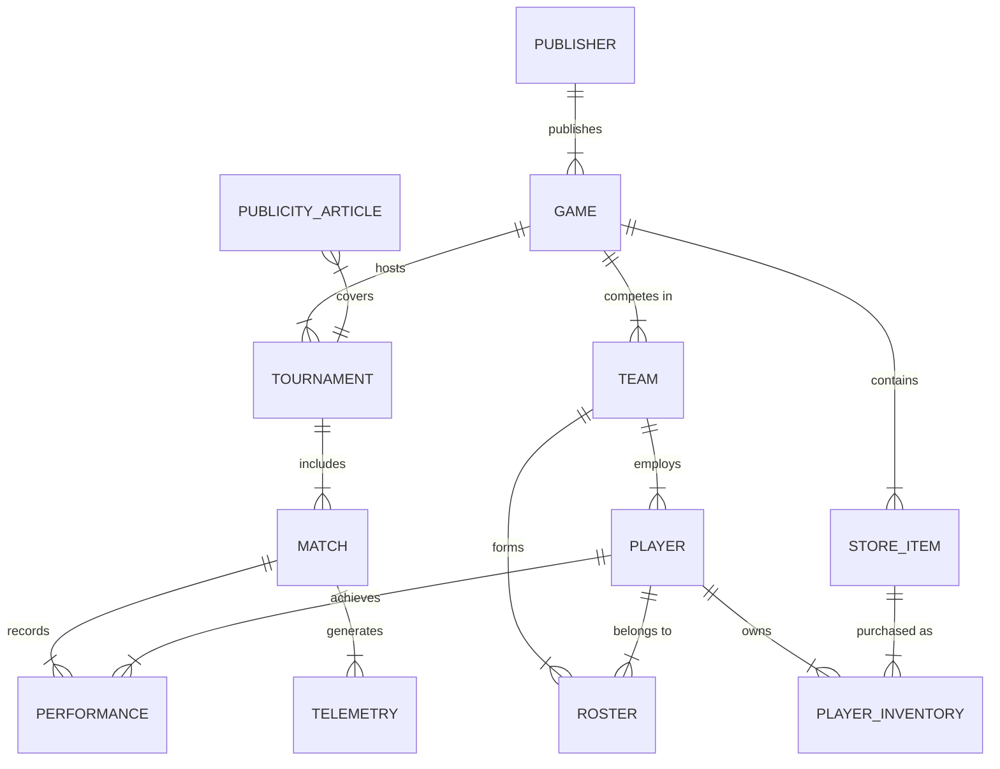

# 🎮 arenaDB 2.0 — Esports & Tournament Database System
## Technical Architecture, Features Summary & Complete Relational Database Schema

---

## 📌 Executive Summary

**arenaDB 2.0** is an enterprise-grade esports management platform and relational database system built to handle real-time tournament tracking, player rosters, performance telemetry, esports circuit leaderboards, and an in-game virtual marketplace with **ACID transaction guarantees**.

---

## 🌟 Key System Modules & Features

### 1. 🛒 Virtual Armory Store & Virtual Currency System (ACID Transactions)
- **Virtual Credit Wallet**: Players earn and spend credits across global tournament circuits.
- **Cosmetics Catalog**: Features 20 high-definition weapon skins, melee heirlooms, champion attire, vehicle bodies, and hero arcanas across major titles (*Valorant, CS2, League of Legends, Apex, Rocket League, Dota 2, Fortnite*).
- **Graceful UI Fallbacks**: Automatic `onError` detection that dynamically renders rarity-coded CSS gradients (Gold/Amber for *Legendary*, Purple for *Epic*, Cyan for *Rare*) whenever image resources are unavailable.
- **ACID Transaction Guarantees**:
  - `POST /api/store/buy`: Atomic deduction of player credits and insertion into `PLAYER_INVENTORY` wrapped in `BEGIN / COMMIT / ROLLBACK`.
  - `POST /api/store/refund` *(Undo / Refund)*: Instant transaction to delete item ownership, refund full credit value back to player wallet, and update real-time frontend states with shrink/revert spring animations.

### 2. 🏆 Esports Circuit Leaderboards & Animated Podium
- **Circuit Filter Bar**: Seamless switching between game circuits (*Valorant, CS2, League of Legends, Apex Legends, Rocket League, Dota 2*).
- **Spring-Animated Top 3 Podium**:
  - Staggered Framer Motion upward entrance animations.
  - Floating hover physics (`whileHover={{ y: -16, scale: 1.04 }}`).
  - Breathing neon drop-shadows matching rank colors (#1 Gold, #2 Silver, #3 Bronze).
- **Contenders Table**: Real-time standings showing win rates, match victories, and total points.

### 3. 👥 Team & Player Roster Management
- Roster composition views showing team captains, active players, substitutes, and ranks.
- Interactive team detail modals with historical performance stats and player profiles.

### 4. ⚔️ Tournament Hub & Match Tracking
- Tournament scheduling, stage progression (*Group Stage, Semifinals, Grand Finals*), prize pool distribution, and match victory logs.

### 5. 📊 Real-time Match Telemetry & Analytics
- Live telemetry stats (*K/D Ratios, Headshot %, Win %, Damage per Round*) parsed per player and match.

### 6. 📰 Media & Publicity Coverage Engine
- Curated esports news articles, interview highlights, and sponsor impression tracking.

---

## 🛠️ Technology Stack

| Layer | Technology |
| :--- | :--- |
| **Frontend Framework** | React 18 (Vite) |
| **Styling & Aesthetics** | Tailwind CSS 3, Vanilla CSS Custom Variables, Glassmorphism |
| **Animation Engine** | Framer Motion |
| **Icons** | Lucide React |
| **Backend Runtime** | Node.js & Express.js |
| **Database System** | PostgreSQL 16 |
| **DB Driver** | `pg` (PostgreSQL Connection Pooling) |

---

## 🗄️ Database Architecture & Entity-Relationship (ER) Diagram



---

## 📄 Complete PostgreSQL Database Schema

### 1. `PUBLISHER`
Stores global game publishing entities.
```sql
CREATE TABLE PUBLISHER (
    publisher_id SERIAL PRIMARY KEY,
    name VARCHAR(100) NOT NULL,
    country VARCHAR(50),
    contact_email VARCHAR(100)
);
```

### 2. `GAME`
Tracks active esports gaming titles.
```sql
CREATE TABLE GAME (
    game_id SERIAL PRIMARY KEY,
    title VARCHAR(100) NOT NULL UNIQUE,
    genre VARCHAR(50) NOT NULL,
    release_year INT,
    publisher_id INT REFERENCES PUBLISHER(publisher_id) ON DELETE CASCADE
);
```

### 3. `PLAYER`
Stores esports competitor profiles, ranks, and credit balance.
```sql
CREATE TABLE PLAYER (
    player_id SERIAL PRIMARY KEY,
    username VARCHAR(50) NOT NULL UNIQUE,
    email VARCHAR(100) NOT NULL UNIQUE,
    rank VARCHAR(50) DEFAULT 'Unranked',
    avatar_id VARCHAR(50) DEFAULT 'default-avatar',
    joined_date DATE DEFAULT CURRENT_DATE,
    credits INT DEFAULT 2500 CHECK (credits >= 0)
);
```

### 4. `TEAM`
Represents professional esports organizations.
```sql
CREATE TABLE TEAM (
    team_id SERIAL PRIMARY KEY,
    name VARCHAR(100) NOT NULL UNIQUE,
    tag VARCHAR(10) NOT NULL UNIQUE,
    captain_id INT REFERENCES PLAYER(player_id) ON DELETE SET NULL,
    game_id INT REFERENCES GAME(game_id) ON DELETE CASCADE,
    region VARCHAR(50) DEFAULT 'Global'
);
```

### 5. `ROSTER`
Junction table tracking player-team assignments and roles.
```sql
CREATE TABLE ROSTER (
    roster_id SERIAL PRIMARY KEY,
    team_id INT REFERENCES TEAM(team_id) ON DELETE CASCADE,
    player_id INT REFERENCES PLAYER(player_id) ON DELETE CASCADE,
    role VARCHAR(50) NOT NULL,
    joined_date DATE DEFAULT CURRENT_DATE,
    UNIQUE(team_id, player_id)
);
```

### 6. `TOURNAMENT`
Records championship events, dates, and prize pools.
```sql
CREATE TABLE TOURNAMENT (
    tournament_id SERIAL PRIMARY KEY,
    name VARCHAR(150) NOT NULL,
    game_id INT REFERENCES GAME(game_id) ON DELETE CASCADE,
    start_date DATE NOT NULL,
    end_date DATE NOT NULL,
    prize_pool NUMERIC(12, 2) CHECK (prize_pool >= 0),
    location VARCHAR(100) DEFAULT 'Online'
);
```

### 7. `MATCH`
Logs individual match fixtures, scores, and status.
```sql
CREATE TABLE MATCH (
    match_id SERIAL PRIMARY KEY,
    tournament_id INT REFERENCES TOURNAMENT(tournament_id) ON DELETE CASCADE,
    team1_id INT REFERENCES TEAM(team_id) ON DELETE CASCADE,
    team2_id INT REFERENCES TEAM(team_id) ON DELETE CASCADE,
    winner_team_id INT REFERENCES TEAM(team_id) ON DELETE SET NULL,
    score_team1 INT DEFAULT 0,
    score_team2 INT DEFAULT 0,
    match_date TIMESTAMP DEFAULT CURRENT_TIMESTAMP,
    status VARCHAR(20) DEFAULT 'Completed' CHECK (status IN ('Scheduled', 'Live', 'Completed'))
);
```

### 8. `PERFORMANCE`
Captures player-level statistics for every match.
```sql
CREATE TABLE PERFORMANCE (
    performance_id SERIAL PRIMARY KEY,
    match_id INT REFERENCES MATCH(match_id) ON DELETE CASCADE,
    player_id INT REFERENCES PLAYER(player_id) ON DELETE CASCADE,
    kills INT DEFAULT 0 CHECK (kills >= 0),
    deaths INT DEFAULT 0 CHECK (deaths >= 0),
    assists INT DEFAULT 0 CHECK (assists >= 0),
    mvp_count INT DEFAULT 0 CHECK (mvp_count >= 0),
    score INT DEFAULT 0
);
```

### 9. `TELEMETRY`
Real-time telemetry metric streams.
```sql
CREATE TABLE TELEMETRY (
    telemetry_id SERIAL PRIMARY KEY,
    match_id INT REFERENCES MATCH(match_id) ON DELETE CASCADE,
    player_id INT REFERENCES PLAYER(player_id) ON DELETE CASCADE,
    headshot_pct NUMERIC(5,2) DEFAULT 0.0,
    os_build VARCHAR(100),
    hardware_faults INT DEFAULT 0
);
```

### 10. `STORE_ITEM`
Virtual armory items catalog.
```sql
CREATE TABLE STORE_ITEM (
    item_id SERIAL PRIMARY KEY,
    game_id INT REFERENCES GAME(game_id) ON DELETE CASCADE,
    name VARCHAR(100) NOT NULL,
    item_type VARCHAR(50) NOT NULL,
    rarity VARCHAR(20) NOT NULL CHECK (rarity IN ('Common', 'Rare', 'Epic', 'Legendary')),
    price_credits INT NOT NULL CHECK (price_credits > 0),
    image_url VARCHAR(500)
);
```

### 11. `PLAYER_INVENTORY`
Tracks purchased cosmetics owned by players.
```sql
CREATE TABLE PLAYER_INVENTORY (
    inventory_id SERIAL PRIMARY KEY,
    player_id INT REFERENCES PLAYER(player_id) ON DELETE CASCADE,
    item_id INT REFERENCES STORE_ITEM(item_id) ON DELETE CASCADE,
    purchase_date TIMESTAMP DEFAULT CURRENT_TIMESTAMP
);
```

---

## ⚡ ACID Transaction Workflow (Buy & Refund)

```
                       [ CLIENT REQUEST ]
                              │
               ┌──────────────┴──────────────┐
               ▼                             ▼
        POST /api/store/buy           POST /api/store/refund
               │                             │
        [ BEGIN TRANSACTION ]         [ BEGIN TRANSACTION ]
               │                             │
    1. Check Balance >= Price      1. Verify Player Ownership
    2. UPDATE PLAYER credits-      2. DELETE FROM PLAYER_INVENTORY
    3. INSERT INTO INVENTORY       3. UPDATE PLAYER credits+
               │                             │
        [ COMMIT TRANSACTION ]        [ COMMIT TRANSACTION ]
               │                             │
        (Rollback on Fail)            (Rollback on Fail)
```

---

## 🚀 How to Run the Application

1. **Start PostgreSQL Database**:
   ```bash
   psql -d arenadb -f db.sql
   ```
2. **Start Backend Server**:
   ```bash
   npm run server
   # Runs API on http://localhost:5001
   ```
3. **Start Frontend Client**:
   ```bash
   npm run dev
   # Opens UI on http://localhost:3000
   ```
